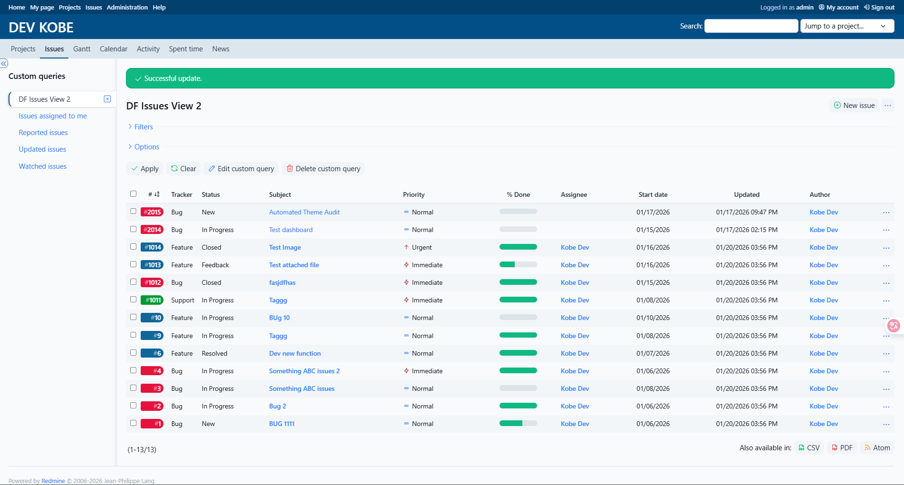

Opale
=====

A Redmine 6.x theme - Custom by Kobe with SaaS Style

---

## Main features

* Left sidebar,
* Colored trackers links,
* Jira-inspired priority icons,
* Customizable with SCSS.

--Based from https://github.com/gagnieray/opale
